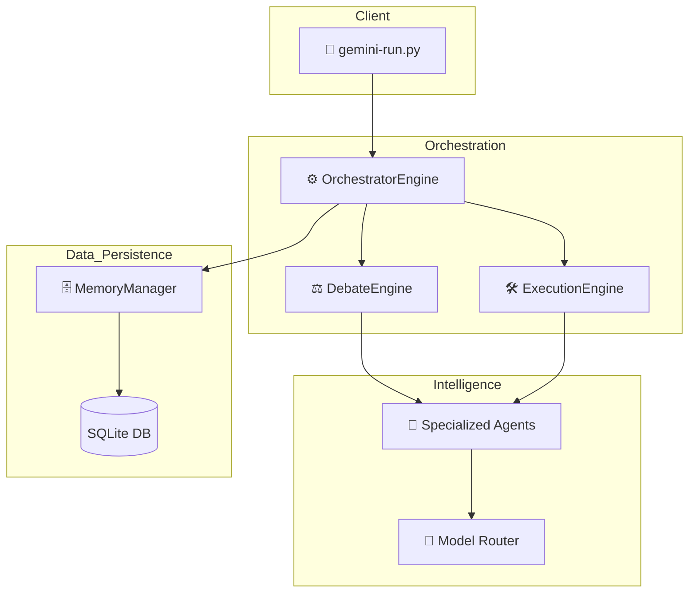

# Codebase Analysis

> **Quick Reference**
> - **Project**: AI Workflow Orchestrator (Production-Grade)
> - **Type**: Agentic Orchestration CLI
> - **Languages**: Python (100%)
> - **Primary Frameworks**: `asyncio`, `sqlite3`, `google-generativeai`, `mistralai`
> - **Lines of Code**: ~2,500 across 28 source files

## Architecture

The system follows a modular, agentic architecture focused on **reasoning-based consensus** and **deterministic execution**.



### Layer Breakdown

1. **Presentation (CLI)**: `gemini-run.py` acts as the primary entry point for user requests.
2. **Orchestration**: `orchestrator/engine.py` coordinates the flow from analysis to execution.
3. **Reasoning (Debate)**: `debate/engine.py` implements "Consensus 2.0," an iterative multi-agent debate mechanism.
4. **Execution (DAG)**: `execution/engine.py` resolves dependencies and swarms agents for parallel task completion.
5. **Intelligence (Agents)**: `agents/` folder contains specialized roles (Analysis, Critic, Security, etc.) and the `ModelRouter` for Gemini/Mistral failover.
6. **Data (Memory)**: `memory/manager.py` handles persistent storage of workflows, debates, and agent reliability scores.

## Directory Structure

```
.
├── agents/             # Specialized agent implementations
├── debate/             # Multi-agent reasoning logic
├── execution/          # DAG-based swarming engine
├── memory/             # Persistence and learning layer
├── observability/      # Logging and execution tracing
├── orchestrator/       # System coordination
├── storage/            # SQLite database files
└── tests/              # Pytest suite
```

## Dependencies

| Category | Package | Purpose |
|----------|---------|---------|
| Core AI | `google-generativeai` | Primary LLM integration (Gemini) |
| Core AI | `mistralai` | Fallback LLM integration |
| Data | `pandas`, `numpy` | Tabular data processing |
| ML Models | `catboost`, `lightgbm`, `xgboost` | High-performance GBDT models |
| Database | `sqlite3` | Local persistence |
| Observability | `logging` | System-wide tracing |

## Database Schema

| Table | Purpose | Key Columns |
|-------|---------|-------------|
| `workflows` | Root workflow tracking | `workflow_id`, `request`, `status`, `metadata` |
| `debates` | Reasoning session history | `debate_id`, `workflow_id`, `final_consensus` |
| `arguments` | Individual agent arguments | `agent_name`, `argument`, `confidence_score` |
| `decisions` | Final audit trail | `decision`, `reasoning_trace` |
| `agent_opinions` | Long-term reliability | `agent_name`, `stance`, `confidence` |
| `execution_traces` | Step-by-step audit | `trace_id`, `step_name`, `details` |

## Key Entry Points

| File | Role | Description |
|------|------|-------------|
| `gemini-run.py` | CLI Entry | Main interface for running workflows. |
| `orchestrator/engine.py` | Engine Entry | Core `AIWorkflowOrchestrator` class. |
| `agents/model_router.py` | Router | Handles LLM failover logic. |

## Test Coverage

| Framework | Test Files | Primary Focus |
|-----------|-----------|---------------|
| `pytest` | 4 | Debate modes, execution engine, robust JSON parsing. |

> **Notes on Testing**: The project uses an "Evidence Before Assertion" mandate, requiring tests for all core logic.
