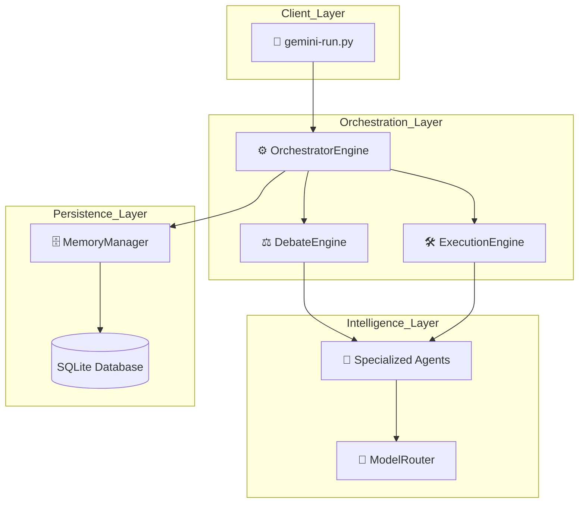
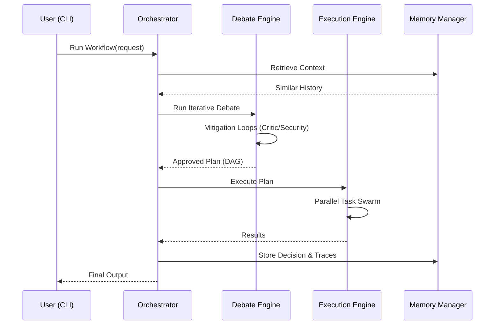

# System Architecture

> **Quick Reference**
> - **Type**: Modular Agentic Orchestrator
> - **Stack**: Python, SQLite, asyncio, Generative AI (Google/Mistral)
> - **Key Modules**: Orchestrator, Debate, Execution, Memory, Observability
> - **Deployment**: Python CLI / Containerized

## Overview
The AI Workflow Orchestrator is a production-grade system designed to execute complex, multi-step tasks using a swarm of specialized AI agents. It ensures reliability through an iterative multi-agent debate mechanism and deterministic DAG-based execution.

## Architecture Diagram

## Core Components

| Component | Description | Technology | Key Files |
|-----------|-------------|------------|-----------|
| **Orchestrator** | Main entry point; manages the workflow lifecycle. | Python, `asyncio` | `orchestrator/engine.py` |
| **Debate Engine** | Reasoning-based consensus gate with mitigation loops. | Python | `debate/engine.py` |
| **Execution Engine**| DAG-based task runner with dependency resolution. | Python | `execution/engine.py` |
| **Memory Manager** | Persistent storage and historical context retrieval. | SQLite3 | `memory/manager.py` |
| **Model Router** | Multi-model failover (Gemini ➜ Mistral). | Python | `agents/model_router.py` |

## Main Processing Flow

## Architecture Decision Records (ADR)

| # | Decision | Context | Status |
|---|----------|---------|--------|
| ADR-001 | **Iterative Debate (Consensus 2.0)** | Linear reasoning failed to address security risks proactively. | Accepted |
| ADR-002 | **DAG-based Execution** | Sequential execution was too slow and lacked modularity. | Accepted |
| ADR-003 | **SQLite Persistence** | Needed local, lightweight, and queryable memory without external overhead. | Accepted |
| ADR-004 | **Multi-pass JSON Parsing** | LLMs frequently produce malformed JSON or markdown-wrapped responses. | Accepted |

ADR-001: Iterative Debate (Consensus 2.0)

**Context**: High-severity risks identified by late-stage agents (Security) would reject the whole workflow without a chance to fix them.

**Decision**: Implement a mitigation loop where the `SolutionAgent` revides the proposal based on `Critic` and `Security` feedback before a final vote.

**Consequences**:
- ✅ Higher success rate for complex requests.
- ✅ Explicit handling of security vulnerabilities.
- ⚠️ Higher token cost due to multiple rounds.

## Security
- **Trust Boundaries**: The `SecurityAgent` acts as a mandatory gate in the debate loop.
- **Veto Rights**: Security risks with HIGH severity and high confidence can unilaterally reject a plan.
- **Logging**: PII and API keys are strictly excluded from structured logs `(observability/logger.py:45)`.

## Scalability & Performance

| Aspect | Strategy | Limit |
|--------|----------|-------|
| Task Execution | Parallel swarming via `asyncio.gather` | Limited by model rate limits |
| Model Failover | Automatic cooldown on failure (5 min) | `agents/model_router.py:15` |
| Memory Lookup | SQLite index similarity search | ~50ms per query |

---

## See Also
- [Codebase Analysis](analysis.md)
- [Database Schema](database.md)
