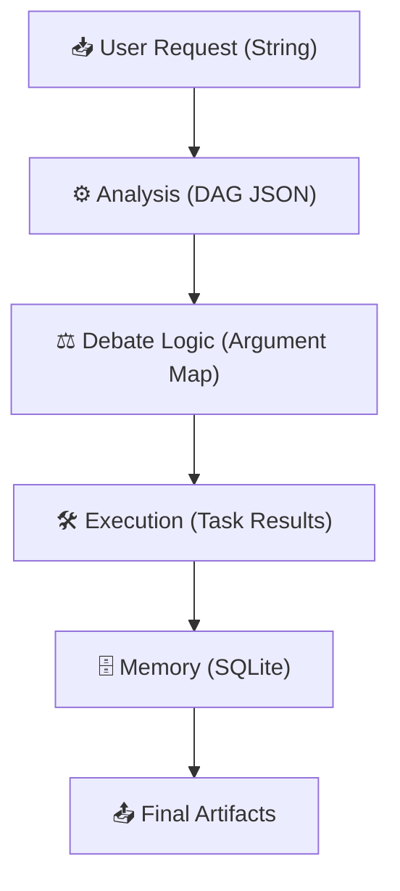
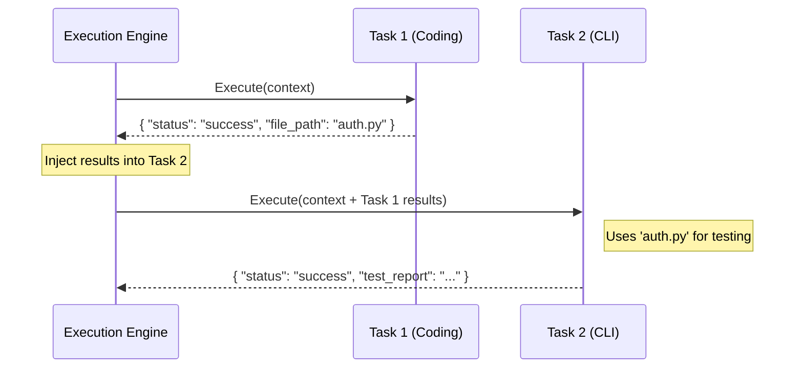

# Data Flow

> **Quick Reference**
> - **Pattern**: Request-Response + State Machine (Consensus)
> - **Protocol**: JSON-RPC (internal agent communication)
> - **Serialization**: JSON (standard) / Markdown-wrapped JSON (robust)

## End-to-End Data Flow

The flow of data from raw user intent to persisted validated state.

## Main Workflows

### Task Result Injection

When executing a DAG, results from upstream tasks are injected into downstream task parameters to enable data-driven swarming.

1. **Execution Engine** identifies Task 1 as ready.
2. **CodingAgent** completes Task 1 and returns a structured dictionary.
3. **Execution Engine** maps Task 1 output to Task 2 input based on the DAG dependencies `(execution/engine.py:75)`.
4. **CLIAgent** receives the context and performs actions on the newly created artifacts.

---

## External Integrations

| Service | Protocol | Direction | Data | Rate Limit |
|---------|----------|-----------|------|------------|
| **Google Vertex AI** | HTTPS (SDK) | Outbound | Prompts/Completion | ~20 RPM (Free Tier) |
| **Mistral AI** | HTTPS (SDK) | Outbound | Prompts/Completion | ~10 RPM |
| **Kaggle API** | HTTPS (CLI) | Outbound | Notebooks/Submissions | Per Kaggle limits |

## Reasoning Traces

The `reasoning_trace` column in the `decisions` table provides a chronological dump of how the system arrived at a conclusion.

| Step | Action | Origin | Sample Payload |
|------|--------|--------|----------------|
| 1 | `start_analysis` | AnalysisAgent | `{"request": "..."}` |
| 2 | `start_challenge` | CriticAgent | `{"logical_flaws": [...]}` |
| 3 | `start_mitigation` | SolutionAgent | `{"revised_plan": "..."}` |

---

## See Also
- [System Architecture](architecture.md)
- [Database Schema](database.md)
