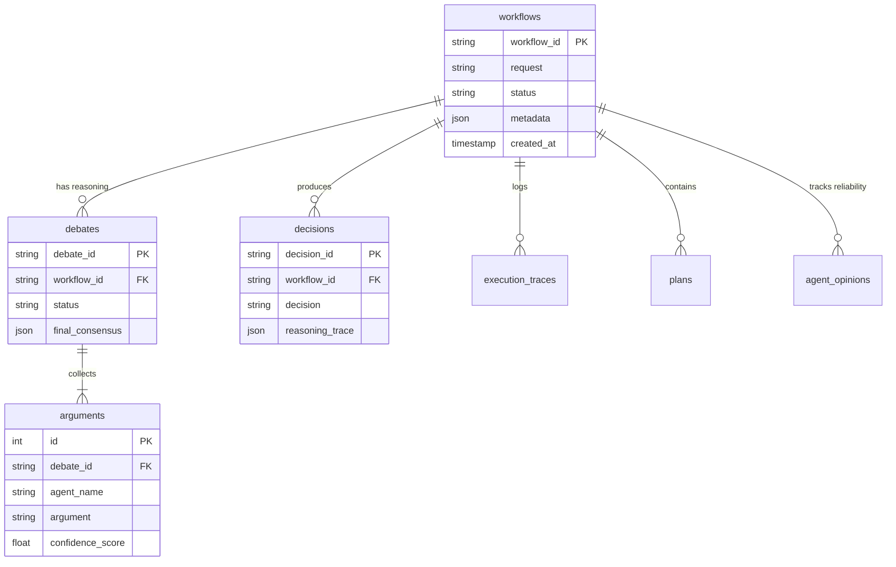

# Database

> **Quick Reference**
> - **Engine**: SQLite3
> - **ORM**: None (Direct SQL for performance and simplicity)
> - **Tables**: 7 core tables
> - **Storage Location**: `storage/memory.db`

## ER Diagram

## Tables

### `workflows`
The root table for all system activity.
| Column | Type | Description |
|--------|------|-------------|
| `workflow_id` | TEXT | Unique ID (wf_...) |
| `request` | TEXT | Original user natural language input. |
| `status` | TEXT | PENDING, COMPLETED, FAILED, REJECTED. |
| `metadata` | TEXT | JSON blob of execution results. |

### `debates`
Stores multi-agent reasoning sessions.
| Column | Type | Description |
|--------|------|-------------|
| `debate_id` | TEXT | Unique ID (deb_...) |
| `final_consensus` | TEXT | Resulting decision and mitigation notes. |

### `agent_opinions`
Tracks agent performance over time to calculate reliability weights.
| Column | Type | Description |
|--------|------|-------------|
| `agent_name` | TEXT | e.g., CriticAgent, SecurityAgent. |
| `stance` | TEXT | APPROVED or REJECTED. |
| `confidence` | REAL | Agent's self-reported confidence. |

## Relationships

| Table A | Table B | Type | FK |
|---------|---------|------|----|
| `workflows` | `debates` | 1:M | `workflow_id` |
| `debates` | `arguments` | 1:M | `debate_id` |
| `workflows` | `execution_traces` | 1:M | `workflow_id` |

## Indexes & Constraints

| Table | Index | Columns | Purpose |
|-------|-------|---------|---------|
| `workflows` | `idx_request` | `request` | Supports similarity lookup `(memory/manager.py:85)`. |
| `execution_traces` | `idx_trace` | `trace_id` | Fast retrieval of full reasoning chains. |

:::tip Performance
The system uses `sqlite3.Row` factory to enable dictionary-like access to query results, making agent integration more idiomatic.
:::

---

## See Also
- [System Architecture](architecture.md)
- [Data Flow](data-flow.md)
