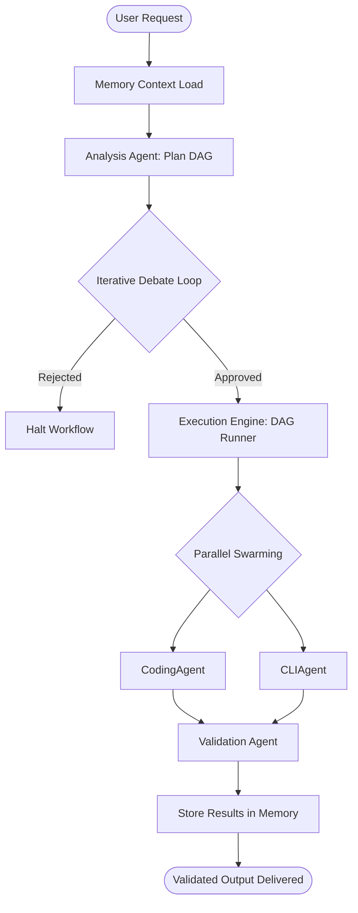
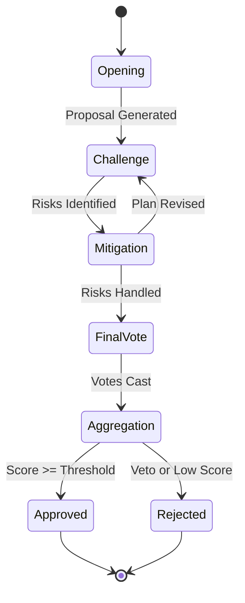
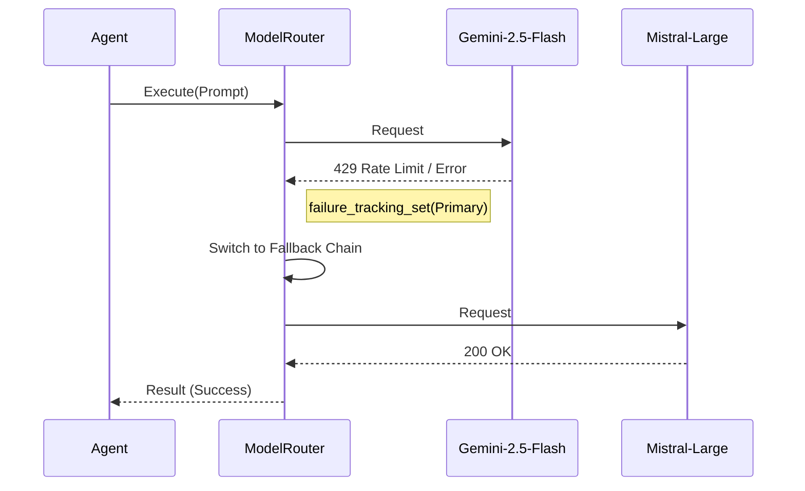

# System Process Flows

> **Quick Reference**
> - **Primary Flow**: The end-to-end "Mission" lifecycle.
> - **Decision Flow**: The Iterative Debate (Consensus 2.0) mechanism.
> - **Fault Tolerance**: Automatic model failover logic.

## 1. End-to-End Workflow Lifecycle

The global journey from a user's natural language request to a validated execution result.

**Description**: The lifecycle starts with context retrieval from SQLite, followed by DAG generation. The system then enters a mandatory debate gate before swarming specialized agents for task completion.

---

## 2. Iterative Debate (Consensus 2.0)

The reasoning engine that ensures technical feasibility and security.

**Description**: A state-based transition where the Challenge phase can trigger multiple Mitigation cycles. Veto rights from Security or Critic agents can immediately transition the state to Rejected.

---

## 3. Model Failover Logic

The resilience mechanism implemented in the `ModelRouter`.

**Description**: When the primary model fails, the router logs the failure, sets a cooldown timer, and routes the next attempt to the fallback chain (Flash-Lite -> Flash -> Pro -> Mistral).

---

## See Also
- [Codebase Analysis](../analysis.md)
- [Jobs-to-be-Done](../jtbd/jobs-to-be-done.md)
