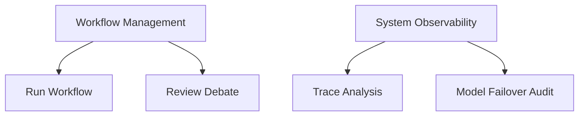

# User Guides

> **Quick Reference**
> - **Total Modules**: 2
> - **Roles**: AI Architect, MLOps, Data Scientist
> - **Last Updated**: 2026-05-14

## Feature Map

## Feature List

| No. | Feature | Description | Role | Difficulty |
|-----|---------|-------------|------|------------|
| 1 | **Run Workflow** | Execute complex tasks via agentic swarms. | Architect | 🟢 Easy |
| 2 | **Review Debate** | Inspect multi-agent reasoning and consensus. | Architect | 🟡 Medium |
| 3 | **Trace Analysis** | Debug step-by-step agent execution. | MLOps | 🔴 Hard |
| 4 | **Kaggle Ops** | Push notebooks and track submissions. | Scientist | 🟢 Easy |

---

## Available Guides
- [Workflow Management](./workflow-management.md)
- [System Observability](./system-observability.md)
